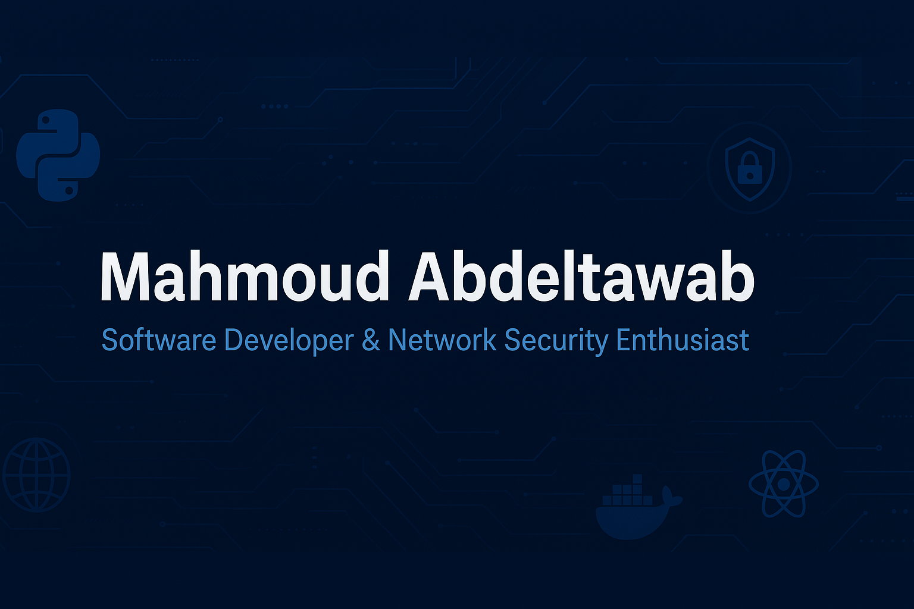

<!-- Banner / Header -->
  
<!-- Replace the link above with your own banner made in Canva/Figma -->

# Mahmoud Abdeltawab  

---

## About Me
- Senior CS Student at **Zewail City University**, majoring in **IT (Network Security & Governance)**  
- Expanding skills in **Software Development** while leveraging **networking & security** background  
- Passionate about **secure, scalable systems** and modern **software engineering practices**  
- Blending **infrastructure knowledge** with **software development** to build real-world solutions  

---

## Skills & Tools  

### Languages & Frameworks

### Networking & Security

### Tools & Platforms

---

## Experience

**IT Helpdesk Intern – Zewail City (5 months)**  
- Provided **technical support** for students, faculty, and staff  
- Troubleshot and resolved **device, network connectivity, and software issues**  
- Assisted in maintaining **computer labs** (cabling, ports, software installation)  
- Hands-on experience in **IT support, networking, and system administration**  

**Software Development Intern – Tseppas (3 months)**  
- Built an **HR Dashboard** system with APIs and data visualization  
- Designed **charts, cards, and filtering** for insights  
- Strengthened **backend & frontend integration** skills  

---

## Projects  

- **[APizza](#)** – Restaurant ordering system using **Django & React**  
- **[Secure Communication System](#)** – Implemented **RSA + Symmetric Encryption** in Python  
- **[VLAN & Inter-VLAN FortiGate](#)** – Designed and configured a segmented enterprise network  

---

## GitHub Stats

  
  

  

---

## Connect with Me

  
  
  

---

*Always eager to learn, build, and contribute to impactful projects!*  
